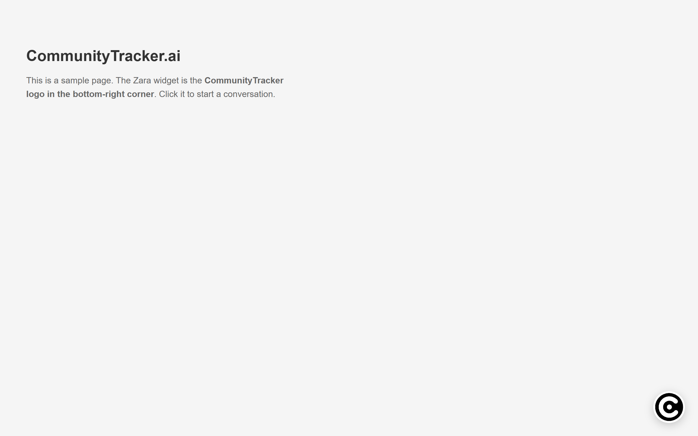
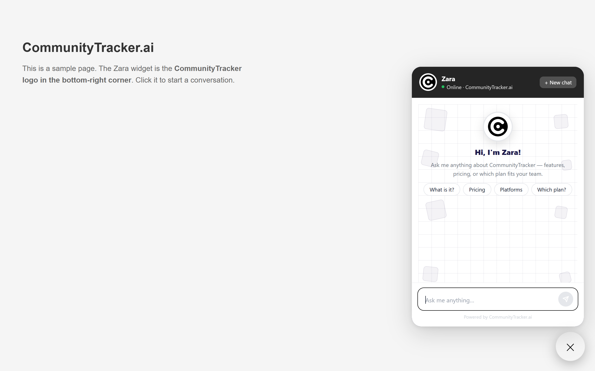
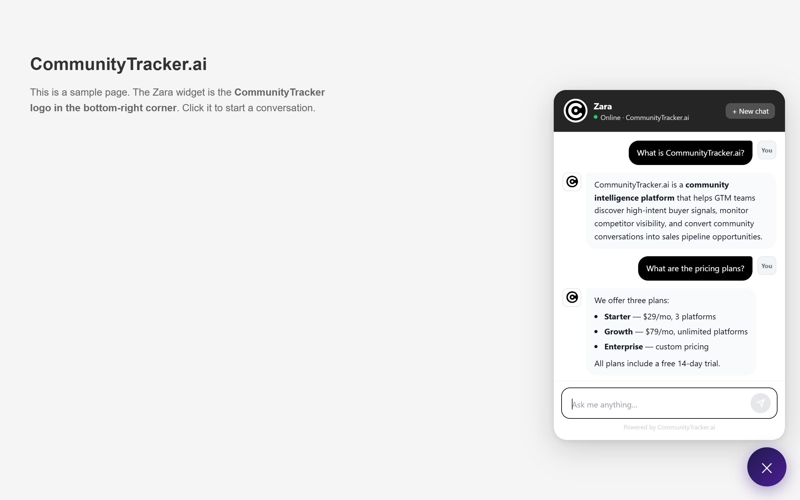

# Zara — AI Chat Assistant for CommunityTracker.ai

Zara is an embeddable AI sales assistant that answers visitor questions about [CommunityTracker.ai](https://communitytracker.ai) in real time. It is powered by **Llama 3.3 70B** running on **Groq**, streamed over Server-Sent Events for instant, token-by-token responses.

---

## Screenshots

### Floating Button


### Welcome Screen


### Live Chat


---

## Features

| Feature | Detail |
|---|---|
| **Streaming responses** | Server-Sent Events (SSE) — text appears token by token, no waiting |
| **Session memory** | Keeps the last 20 messages per conversation so Zara remembers context |
| **Quick-question cards** | One-click prompts on the welcome screen for pricing, platforms, intent detection, and more |
| **Sidebar navigation** | Quick-access buttons for common questions; links to the live site and pricing page |
| **Markdown rendering** | Bot replies render bold, lists, headings, and inline code blocks |
| **Mobile responsive** | Sidebar collapses on small screens with a slide-in drawer + overlay |
| **Auto session cleanup** | Server purges sessions idle for 30 minutes to keep memory usage low |
| **Model indicator** | Live status pill showing the active model (Llama 3.3 70B · Groq) |

---

## Tech Stack

**Backend**
- Node.js (ESM) + Express
- [Groq SDK](https://www.npmjs.com/package/groq-sdk) — Llama 3.3 70B Versatile
- `dotenv` for environment config
- CORS restricted to known origins

**Frontend**
- Single-file vanilla HTML/CSS/JS (`demo/index.html`) — zero dependencies, no build step
- Server-Sent Events for streaming
- CSS custom properties + responsive layout

---

## Project Structure

```
PROJECT ZARA/
├── backend/
│   ├── server.js          # Express API — /api/session, /api/chat, /health
│   ├── .env               # API keys and allowed origins (not committed)
│   ├── .env.example       # Template for required env vars
│   └── package.json
├── demo/
│   └── index.html         # Standalone chat UI — open directly in a browser
├── widget/                # Embeddable widget (coming soon)
└── screenshots/           # UI screenshots used in this README
```

---

## Getting Started

### Prerequisites
- Node.js 18+
- A [Groq API key](https://console.groq.com)

### 1. Install backend dependencies

```bash
cd backend
npm install
```

### 2. Configure environment variables

Copy the example file and fill in your key:

```bash
cp .env.example .env
```

`.env` contents:

```env
GROQ_API_KEY=your_groq_api_key_here
PORT=3001
ALLOWED_ORIGINS=https://communitytracker.ai,http://localhost:3000,http://127.0.0.1:5500
```

### 3. Start the backend

```bash
node server.js
```

You should see:
```
Zara backend running on http://localhost:3001 (Llama 3.3 70B via Groq)
```

### 4. Open the demo

Open `demo/index.html` directly in your browser — no extra server needed.

> **Tip (Windows):** To run the backend silently in the background:
> ```powershell
> Start-Process -FilePath "node" -ArgumentList "server.js" -WorkingDirectory ".\backend" -WindowStyle Hidden
> ```

---

## API Reference

### `POST /api/session`
Creates a new conversation session.

**Response**
```json
{ "sessionId": "uuid-v4" }
```

---

### `POST /api/chat`
Sends a message and streams the reply via SSE.

**Request body**
```json
{
  "message": "What is the pricing?",
  "sessionId": "uuid-v4"
}
```

**SSE stream events**
```
data: {"text": "Sure! Here"}
data: {"text": " are the plans..."}
data: [DONE]
```

**Error event**
```
data: {"error": "Something went wrong. Please try again."}
```

---

### `GET /health`
Returns server status and active model.

```json
{ "status": "ok", "model": "llama-3.3-70b-versatile" }
```

---

## Environment Variables

| Variable | Required | Default | Description |
|---|---|---|---|
| `GROQ_API_KEY` | Yes | — | Your Groq API key |
| `PORT` | No | `3001` | Port the Express server listens on |
| `ALLOWED_ORIGINS` | No | `http://localhost:3000` | Comma-separated list of allowed CORS origins |

> **Note:** When opening `demo/index.html` as a local `file://` URL, the browser sends `Origin: null`. The server handles this correctly.

---

## Deployment Notes

- The backend is stateless except for the in-memory session store. For production, replace the `sessions` Map with Redis.
- Point `ALLOWED_ORIGINS` at your production domain before deploying.
- The demo HTML can be served from any static host (Netlify, Vercel, S3, etc.) — just update the `API` constant at the top of `index.html` to point at your deployed backend URL.

---

## About CommunityTracker.ai

CommunityTracker.ai is a community intelligence platform for GTM teams. It discovers high-intent buyer signals, tracks competitor share of voice, and routes opportunities to your CRM and sales tools — across Reddit, LinkedIn, Discord, X/Twitter, GitHub, and 9+ more platforms.

- Website: [communitytracker.ai](https://communitytracker.ai)
- Pricing: [communitytracker.ai/pricing](https://communitytracker.ai/pricing)
- Support: support@communitytracker.ai
